# Nika Arts Studio Admin and End-User Guide

This is a visual operating guide for the person managing Nika Arts Studio. It uses diagrams and quick-reference tables first, with only short notes where needed.

## 1. Big Picture

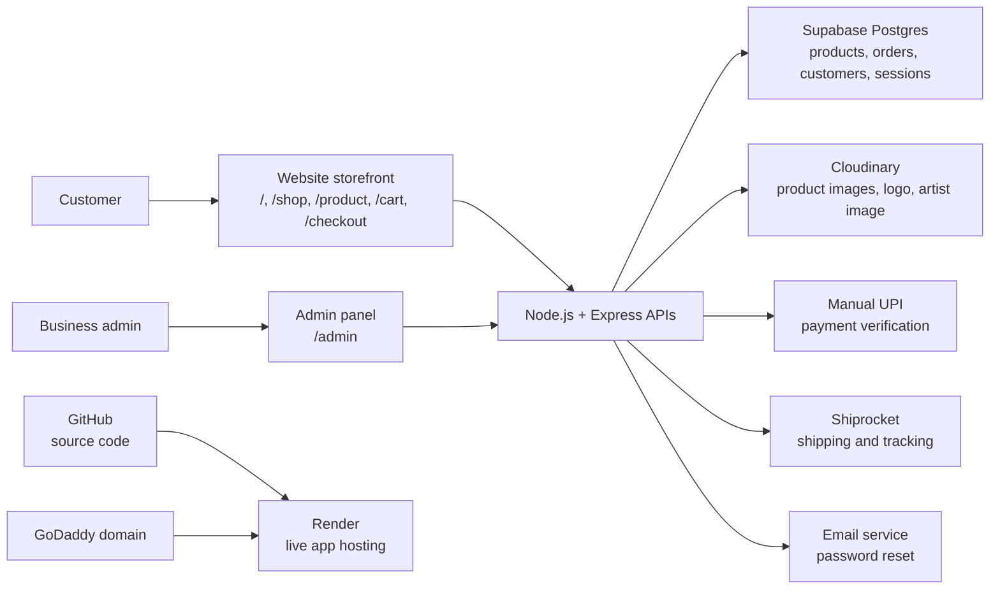

### Where Things Live

| What | Where it lives | Who usually touches it |
|---|---|---|
| Code | GitHub | Developer/admin with technical access |
| Live app | Render | Developer/admin |
| Products/orders/customers | Supabase Postgres | App and admin panel |
| Product images | Cloudinary | Admin panel |
| Logo/artist image | Cloudinary | Admin CMS |
| Domain/DNS | GoDaddy + Render | Owner/developer |
| Payment setup | Manual UPI now; PhonePe later | Business owner |
| Shipping setup | Shiprocket | Business owner/admin |

## 2. Customer Site Map

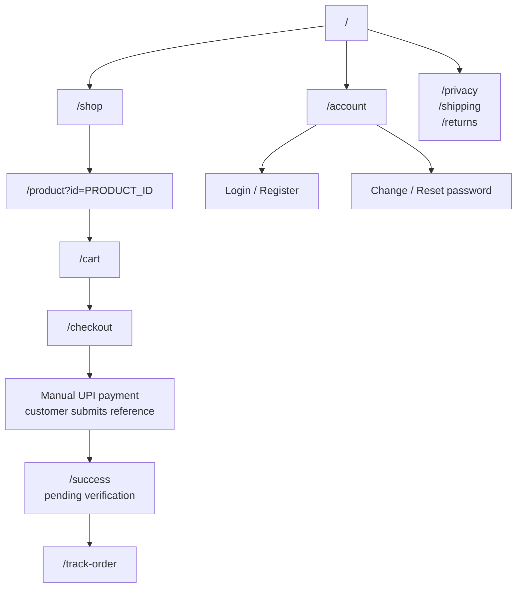

Clean URLs are used for customers. Old `.html` URLs redirect to these clean routes.

## 3. Admin Panel Map

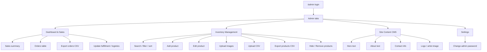

## 4. Admin Privileges

| Area | Admin can do |
|---|---|
| Login/security | Log in, log out, change admin password |
| Dashboard | View sales summary, top products, low stock |
| Orders | View orders, export orders, update fulfillment/logistics status |
| Products | Add, edit, hide, remove, search, filter, sort, paginate |
| Stock | Update stock through product editor |
| Images | Upload single product image, bulk upload images, upload logo/artist image |
| CSV | Bulk upload products, export products |
| CMS | Edit hero, about, contact, logo, artist image |

Current limitations:

| Not available yet | Why it matters |
|---|---|
| Multi-admin management screen | Needed if more staff need separate accounts |
| Role-based permissions | Needed if staff should have limited access |
| Refund management | Payment refunds still need business/payment process |
| Shiprocket label screen | Shiprocket order creation exists, but label workflow needs final live validation |
| Admin audit log screen | Helpful for tracking who changed what |

## 5. Product Upload Workflows

### A. Add One Product

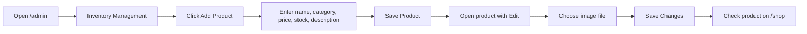

Quick checklist:

| Field | Rule |
|---|---|
| Name | Clear customer-facing product name |
| Category | Reuse existing category when possible |
| Price | Number only, in INR |
| Stock | Current sellable quantity |
| Description | Short and customer friendly |
| Image | JPEG, PNG, or WEBP, max 4 MB |

### B. Bulk Upload Images First

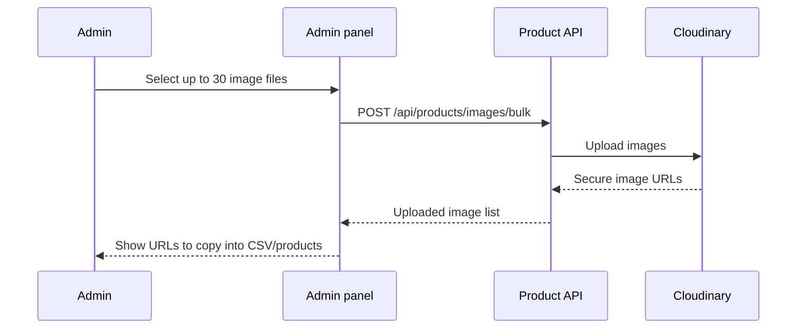

Use this when preparing many products at once.

### C. Bulk Upload Products by CSV

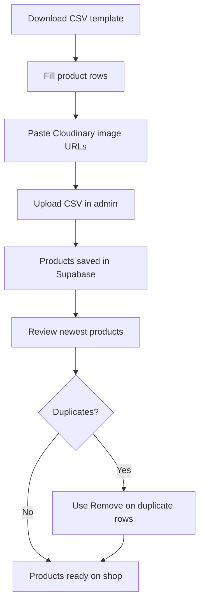

CSV format:

```csv
Name,Category,Price,Stock,Image,Description
Bee Couple Keychains,Keychains,499,5,https://res.cloudinary.com/.../bee-couple.jpg,Handmade crochet bee couple keychains.
```

CSV upload adds products. It does not merge duplicates automatically.

## 6. Product Status Decision Tree

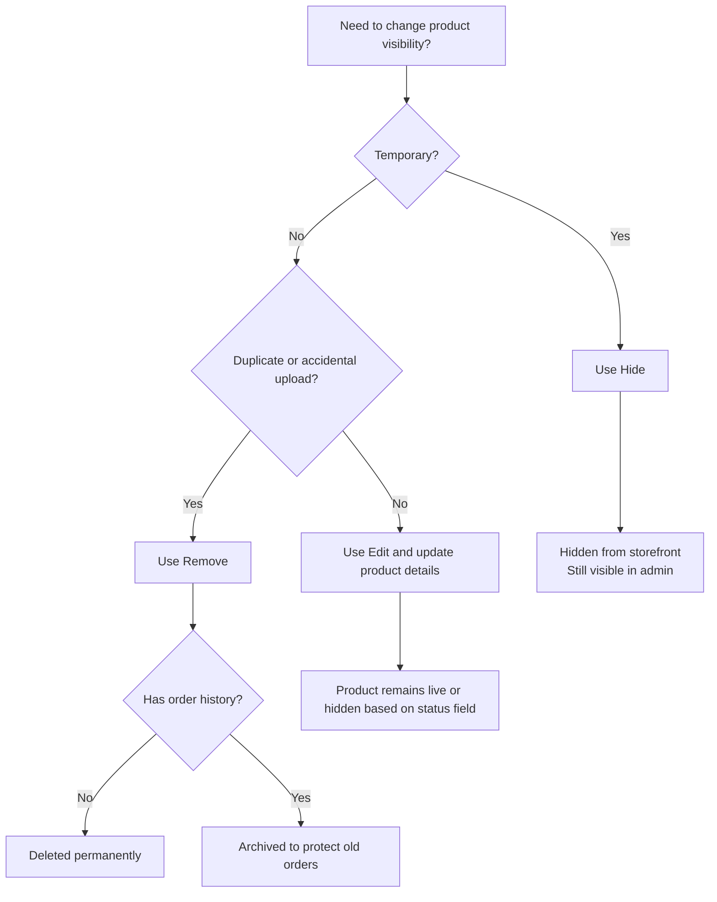

| Action | Use when | Result |
|---|---|---|
| Edit | Correct name, price, stock, category, description, image | Product updated |
| Hide | Temporarily stop selling | Not shown to customers |
| Remove | Duplicate/test/wrong product | Deleted or archived safely |

## 7. Order Workflow

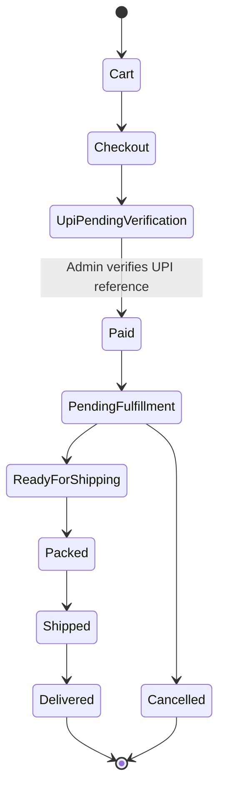

Admin order controls:

| Field | Values |
|---|---|
| Fulfillment | `PENDING`, `READY_FOR_SHIPPING`, `PACKED`, `SHIPPED`, `DELIVERED`, `CANCELLED` |
| Payment | `UPI_PENDING_VERIFICATION`, `PAID` |
| Logistics | `NOT_CREATED`, `CREATED`, `PICKUP_SCHEDULED`, `IN_TRANSIT`, `DELIVERED`, `RETURNED`, `FAILED` |

Admin steps:

1. Open `/admin -> Dashboard & Sales`.
2. Find order.
3. For manual UPI orders, verify the reference in your bank/UPI app.
4. Click **Verify payment** only after money is received.
5. Update fulfillment/logistics dropdown.
6. Click **Save**.

## 8. Customer Account and Password Flow

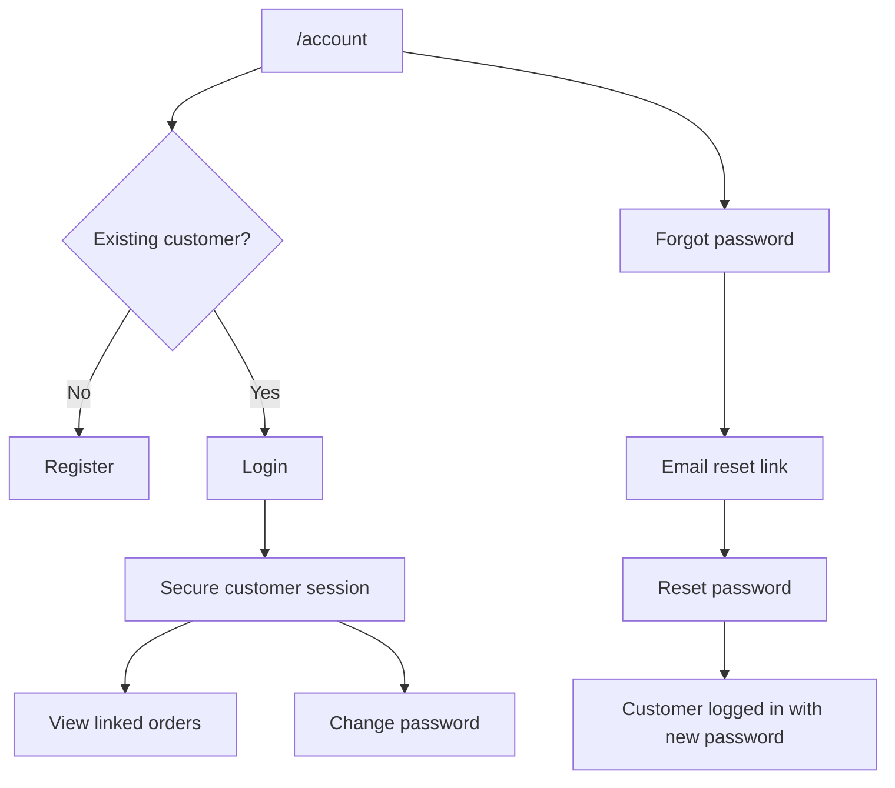

Password reset email needs:

```text
EMAIL_USER
EMAIL_PASS
BASE_URL
```

Production `BASE_URL` should be:

```text
https://nikaartscreations.com
```

## 9. Shipping Logic

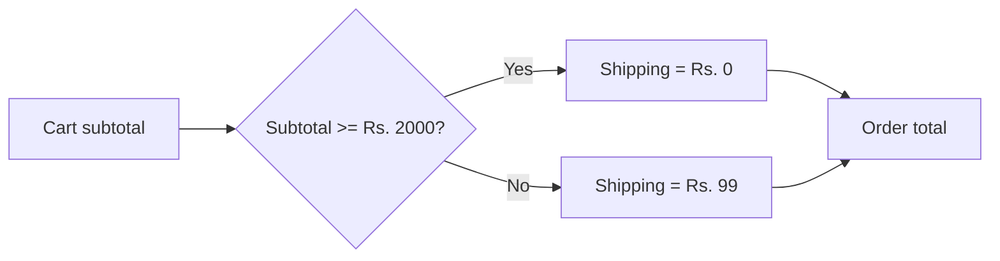

Configured through environment variables:

```text
SHIPPING_FEE=99
FREE_SHIPPING_MINIMUM=2000
```

## 10. CMS Workflow

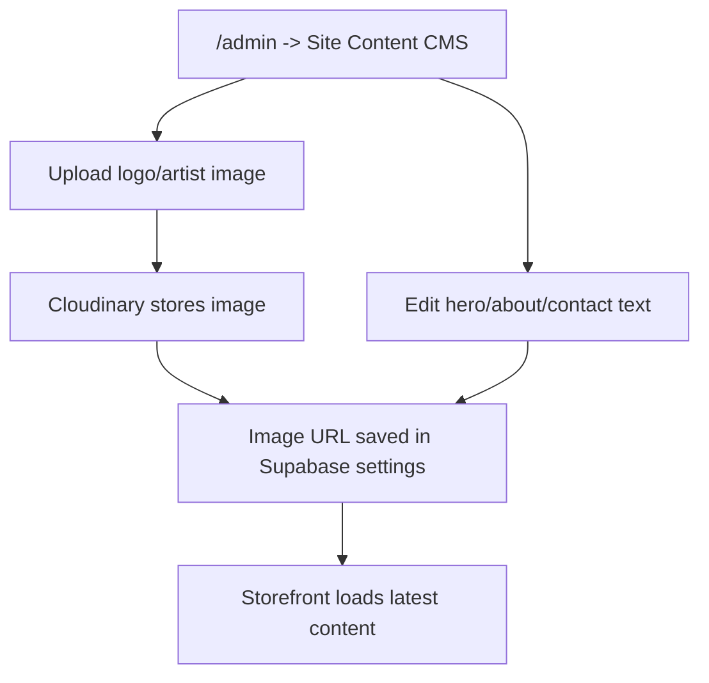

CMS fields:

| Section | Admin can update |
|---|---|
| Hero | Eyebrow, title, subtitle |
| Images | Logo image, artist image |
| About | Eyebrow, title, paragraph 1, paragraph 2 |
| Contact | Email, display phone, phone link |

Use simple HTML only in the hero title, such as `<em>highlighted text</em>`.

## 11. Deployment Flow

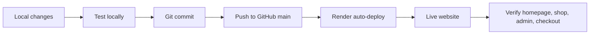

Render settings:

| Setting | Value |
|---|---|
| Build command | `npm install` |
| Start command | `npm start` |
| Node version | `>=24.0.0` |

## 12. Production Environment Checklist

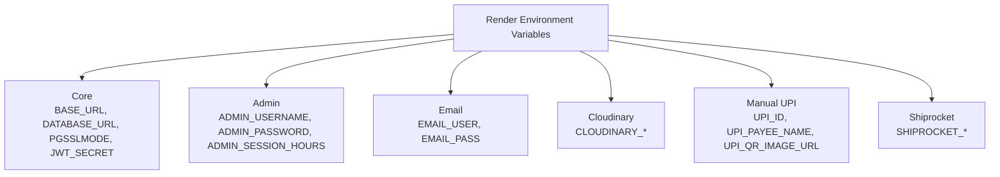

Important production values:

| Group | Required values |
|---|---|
| Core | `BASE_URL`, `DATABASE_URL`, `PGSSLMODE`, `JWT_SECRET` |
| Admin | `ADMIN_USERNAME`, `ADMIN_PASSWORD`, `ADMIN_SESSION_HOURS` |
| Email | `EMAIL_USER`, `EMAIL_PASS` |
| Cloudinary | `CLOUDINARY_CLOUD_NAME`, `CLOUDINARY_API_KEY`, `CLOUDINARY_API_SECRET` |
| Manual UPI | `UPI_ID`, `UPI_PAYEE_NAME`, `UPI_QR_IMAGE_URL` |
| Shiprocket | `SHIPROCKET_EMAIL`, `SHIPROCKET_PASSWORD`, `SHIPROCKET_PICKUP_LOCATION`, `SHIPROCKET_PICKUP_PINCODE` |

Never commit `.env`.

## 13. Testing Map

```mermaid
flowchart TD
  Smoke["Production smoke test"] --> Home["Home page loads"]
  Smoke --> Shop["Shop products/images load"]
  Smoke --> Cart["Add to cart works"]
  Smoke --> Checkout["Shipping rule shown correctly"]
  Smoke --> Admin["Admin login works"]
  Smoke --> Inventory["Inventory loads"]
  Smoke --> CMS["CMS image/content update works"]
  Smoke --> Customer["Customer login/logout works"]
  Smoke --> Reset["Password reset email works"]
  Smoke --> Track["Order tracking works"]
  Smoke --> Payment["Manual UPI test order + admin verification"]
  Smoke --> Ship["Shiprocket serviceability"]
```

Useful health/API URLs:

```text
/api/health
/api/products
/api/content
/api/config
```

Admin-only product view:

```text
/api/products?includeInactive=true
```

## 14. What Has Been Built

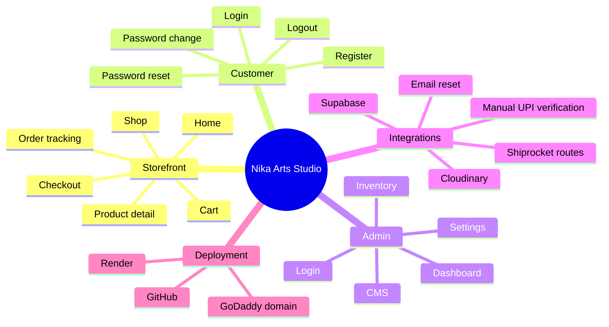

## 15. Pending Work

| Priority | Item | Reason |
|---|---|---|
| High | Shiprocket live order verification | Pickup/order creation must be confirmed live |
| Medium | PhonePe production gateway | Add later after business onboarding if automatic payments are required |
| High | Final domain + `BASE_URL` | Needed for correct reset links and callbacks |
| High | Password reset live test | Confirms email and domain setup |
| Medium | Policy page final wording | Business/legal clarity |
| Medium | Supabase backup/export routine | Recovery safety |
| Medium | GST display decision | Depends on registration/tax advice |
| Later | Multi-admin roles | Useful when more operators join |
| Later | Admin audit log screen | Useful for traceability |
| Later | Product SEO metadata | Better search visibility |

## 16. Admin Routine

```mermaid
flowchart TD
  Daily["Daily"] --> Orders["Check orders"]
  Daily --> LowStock["Check low stock"]
  Daily --> Status["Update fulfillment/logistics"]

  ProductDay["When adding products"] --> UploadImages["Upload images"]
  ProductDay --> AddProducts["Add manually or CSV"]
  ProductDay --> ReviewShop["Review /shop"]
  ProductDay --> RemoveDupes["Remove duplicates"]

  Weekly["Weekly"] --> ExportProducts["Export products CSV"]
  Weekly --> ExportOrders["Export orders CSV"]
  Weekly --> HiddenReview["Review hidden products"]

  Monthly["Monthly"] --> Policies["Review policies"]
  Monthly --> Security["Review admin password/access"]
  Monthly --> Integrations["Check payment/logistics reports"]
```

## 17. Troubleshooting Quick Matrix

| Problem | Check first | Likely fix |
|---|---|---|
| Product image missing | Image URL opens directly? | Re-upload image or update product image |
| Product duplicated | CSV uploaded twice? | Use **Remove** on duplicate |
| Product not on shop | Product hidden? Category filter active? | Edit status to Live |
| Admin login fails | Password, Supabase, env vars | Reset/seed admin or check DB |
| Reset email missing | `EMAIL_USER`, `EMAIL_PASS`, `BASE_URL` | Fix env and redeploy |
| Cloudinary not active | `CLOUDINARY_*` env vars | Add vars and redeploy |
| Supabase connection fails | Pooler URL and SSL | Use pooler host and `PGSSLMODE=require` |
| UPI details missing on checkout | `UPI_ID`, `UPI_PAYEE_NAME`, `UPI_QR_IMAGE_URL` | Add env vars in Render and redeploy |

## 18. Security Reminders

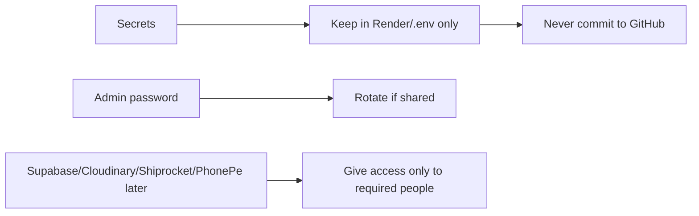

Keep private:

- `.env`
- Supabase database URL/password
- Cloudinary API secret
- UPI QR/payment details
- PhonePe salt key if gateway is enabled later
- Shiprocket password
- Gmail app password
- Admin password

## 19. Full Workflow Snapshot

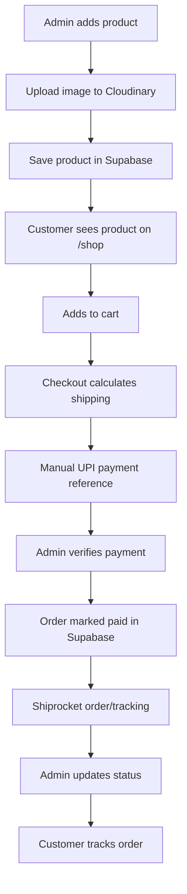

That is the core business loop of the site.
