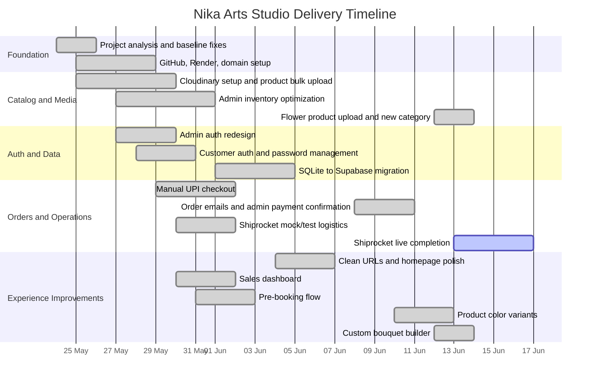
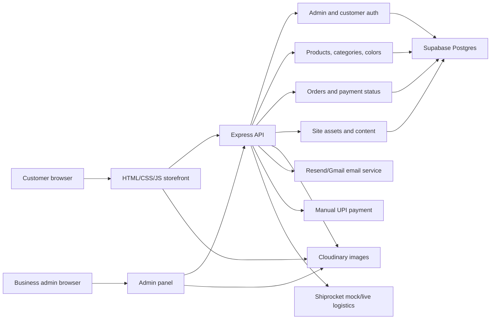
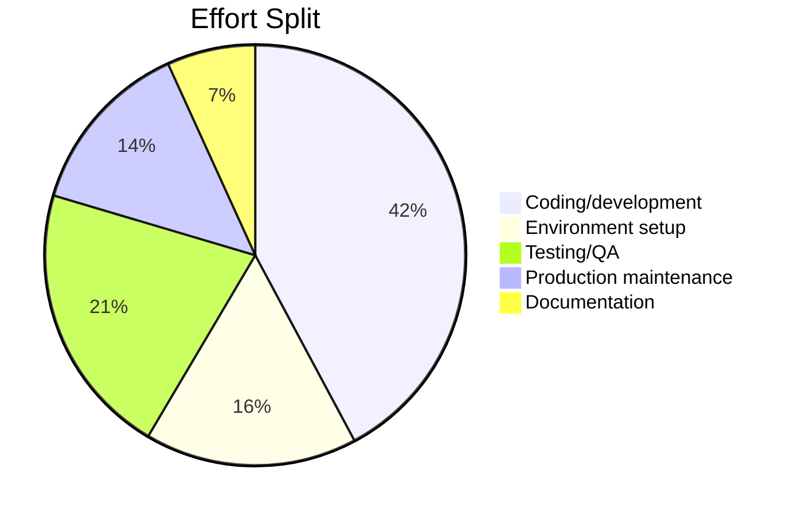
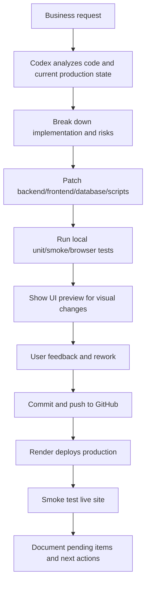

# Nika Arts Studio Project Management Dashboard

Project window: 24 May 2026 to 13 June 2026  
Delivery model: Codex-assisted build, test, deployment, and production support  
Current status: Production website live, core commerce flow active, Shiprocket/PhonePe pending final live enablement

## 1. Executive Dashboard

| Area | Status | Business outcome |
| --- | --- | --- |
| Customer storefront | Done | Customers can browse products, view details, choose colors where configured, build custom bouquets, add to cart, and place manual UPI orders. |
| Admin operations | Done | Business admin can manage products, stock, images, categories, orders, payment verification, dashboard metrics, and site content. |
| Cloud storage | Done | Product, logo, hero, and artist images moved away from local-only storage to Cloudinary. |
| Database | Done | SQLite migrated to Supabase Postgres for cloud-backed production data. |
| Authentication | Done | Admin and customer login/logout/password management implemented. |
| Payments | Partial | Manual UPI flow implemented. PhonePe intentionally paused until business account is ready. |
| Shipping | Partial | Shiprocket mock/test support implemented; live use pending real pickup/account validation. |
| Production hosting | Done | GitHub + Render + custom domain flow established. |
| Documentation | Done | README and admin guide updated; this PM dashboard adds work breakdown and acceptance criteria. |

## 2. Timeline View

## 3. Architecture Snapshot

## 4. Effort Dashboard

These are retrospective planning estimates for Codex-assisted work. They include coding, debugging, preview runs, environment setup, production checks, and rework caused by third-party accounts or limits.

| Effort type | Estimated effort | Share | Notes |
| --- | ---: | ---: | --- |
| Coding/development | 62 hours | 42% | Frontend, backend APIs, database logic, admin UI, checkout, bouquet builder. |
| Environment setup | 24 hours | 16% | GitHub, Render, Supabase, Cloudinary, email, domains, env variables. |
| Testing/QA | 31 hours | 21% | Smoke tests, browser previews, mobile checks, admin workflows, migration verification. |
| Production maintenance | 20 hours | 14% | Render deployment issues, DNS recovery, account recovery, prod/test differences. |
| Documentation/project management | 10 hours | 7% | README, admin guide, diagrams, this dashboard, operational notes. |

## 5. Epic Breakdown

| Epic | Objective | Status | Key acceptance criteria |
| --- | --- | --- | --- |
| E1. Storefront foundation | Build customer-facing shopping website. | Done | Home, shop, product, cart, checkout, success, account, and track pages are reachable through clean URLs. Products load from API. |
| E2. Cloud image management | Move product and site images to free cloud storage. | Done | Admin can upload Cloudinary images. Products display Cloudinary URLs. Logo/hero/artist images load from cloud. |
| E3. Admin inventory operations | Give layman admin a clean way to manage catalog. | Done | Admin can add, edit, hide, delete, search, filter, bulk upload/export products, and update stock without layout issues. |
| E4. Authentication and security | Secure admin/customer access. | Done | Admin/customer login/logout works. Password change/reset works. Sessions expire. Password hashes are not reversible. |
| E5. Supabase migration | Replace local SQLite with hosted Postgres. | Done | Products, customers, orders, sessions, categories, and settings persist in Supabase. Render uses pooler connection string. |
| E6. Manual UPI order flow | Allow payment without PhonePe business approval. | Done | Checkout shows UPI ID/QR, customer submits reference, order stays pending until admin confirms payment. |
| E7. Order communication | Send order/payment status emails. | Partial | Customer/admin email templates exist. Admin confirmation link exists. Production mail delivery still needs provider/domain validation. |
| E8. Shipping/logistics | Prepare Shiprocket integration. | Partial | Mock mode supports testing. Live mode isolated from test. Admin can update fulfillment status. Live Shiprocket final verification pending. |
| E9. Admin dashboard and reporting | Provide sales visibility for admin. | Done | Dashboard shows overall sales, product-level sales, recent orders/logistics, and all-orders page. |
| E10. Pre-booking | Allow out-of-stock products to be reserved. | Done | Out-of-stock product can be pre-booked at advance amount. Admin can restore stock and trigger balance payment flow. |
| E11. Product variants | Support product color choices. | Done | Admin can configure multiple colors and images. Customer sees default image first and selected color image after choosing. |
| E12. Custom bouquet builder | Let customers compose custom bouquet. | Done | Custom Bouquet category exists. Customer can select flower sticks/colors, preview a realistic arrangement, reset, and see estimate. |
| E13. Production operations | Make project deployable and maintainable. | Done | GitHub main/dev flow exists. Render deploys from GitHub. Custom domain is connected. Env variable list is documented. |

## 6. User Story Register

Priority: P1 critical, P2 important, P3 useful.  
Story points are relative effort under Codex-assisted delivery. Larger values usually mean more iteration, environment work, or production risk.

| ID | Epic | User story | Priority | Effort type | Points | Status | Acceptance criteria |
| --- | --- | --- | --- | --- | ---: | --- | --- |
| US-001 | E1 | As a customer, I want a home page that introduces Nika Arts Studio so I can trust the brand before shopping. | P1 | Development + QA | 5 | Done | Home page loads quickly, uses Cloudinary hero/logo assets, and links to shop/about/contact. |
| US-002 | E1 | As a customer, I want to browse all products and filter by category. | P1 | Development | 5 | Done | Shop shows live products from API, category filters work, empty categories are not shown unless intentional. |
| US-003 | E1 | As a customer, I want clean URLs without `.html`. | P2 | Development + production | 3 | Done | `/`, `/shop`, `/admin`, `/track-order`, and product URLs work through Express route rewrites. |
| US-004 | E1 | As a customer, I want mobile-friendly product cards. | P1 | QA + frontend | 3 | Done | View/Add to cart buttons fit on mobile, product cards do not overlap, product detail back link returns to category context. |
| US-005 | E2 | As an admin, I want product images stored in Cloudinary. | P1 | Environment + development | 8 | Done | Cloudinary credentials are configurable, uploads return URLs, product images load in admin and storefront. |
| US-006 | E2 | As an admin, I want to bulk upload Cloudinary products using CSV. | P1 | Development + QA | 8 | Done | CSV template works, uploaded products/images appear in inventory, duplicate cleanup is possible. |
| US-007 | E2 | As a site owner, I want logo/artist images from Cloudinary. | P2 | Development | 3 | Done | Site assets are configurable and loaded from Cloudinary rather than local hardcoded paths. |
| US-008 | E3 | As an admin, I want a compact inventory view. | P1 | Frontend + QA | 5 | Done | Inventory supports search, category/status filters, sort, pagination/compact rows, and aligned action buttons. |
| US-009 | E3 | As an admin, I want to remove duplicate or old products. | P1 | Backend + QA | 5 | Done | Delete works for manually added and CSV-uploaded products. In-house confirmation replaces JavaScript alert. |
| US-010 | E3 | As an admin, I want a smaller edit modal for stock updates. | P2 | Frontend QA | 2 | Done | Modal fits viewport better, save button is reachable without relying on Enter key. |
| US-011 | E4 | As a business admin, I want secure admin login/logout. | P1 | Backend + security | 8 | Done | Admin user is seeded from env when needed, login/logout works, sessions are stored securely, password is hashed. |
| US-012 | E4 | As an admin, I want password management. | P1 | Backend + QA | 5 | Done | Admin can change password from settings and old password no longer works. |
| US-013 | E4 | As a customer, I want account signup/login/logout. | P1 | Backend + frontend | 8 | Done | Customer can register, login, logout, and view account/order details. |
| US-014 | E4 | As a customer, I want forgot/reset password. | P1 | Backend + email | 8 | Done | Reset token flow exists, email link uses `BASE_URL`, local fallback only used for development. |
| US-015 | E5 | As a site owner, I want cloud database storage. | P1 | Environment + backend | 13 | Done | Supabase tables exist, app uses Postgres pooler, migration scripts safely copy old data, products/orders persist after deploy. |
| US-016 | E5 | As a developer/operator, I want migration tests. | P1 | QA | 5 | Done | Smoke scripts validate products, login/logout, password flows, and checkout initiation against cloud database. |
| US-017 | E6 | As a customer, I want manual UPI checkout. | P1 | Backend + frontend | 8 | Done | Checkout displays UPI ID, amount, QR/copy/open UPI options, collects reference ID, and creates pending order. |
| US-018 | E6 | As an admin, I want to verify manual UPI payments. | P1 | Backend + admin UI | 8 | Done | Admin payment confirmation screen shows order details, mode, amount, and button to mark payment received. |
| US-019 | E7 | As a customer, I want order confirmation emails. | P1 | Email + QA | 5 | Partial | Email template includes products, price, order ID, status, and tracking link. Production provider must be validated. |
| US-020 | E7 | As an admin, I want new order notification emails. | P1 | Email + admin ops | 5 | Partial | Admin email includes order details and payment confirmation link before payment is verified. Provider/domain delivery still needs production confirmation. |
| US-021 | E8 | As an admin, I want Shiprocket testing without live charges. | P1 | Backend + test env | 5 | Done | Test environment can use mock responses for serviceability, order creation, tracking, and edge cases. |
| US-022 | E8 | As an admin, I want live Shiprocket fulfillment. | P1 | Environment + production | 8 | Pending | Live credentials, pickup location, serviceability, shipment creation, AWB/tracking, and customer updates verified in production. |
| US-023 | E9 | As an admin, I want overall sales dashboard. | P1 | Dashboard dev | 5 | Done | Dashboard separates overall sales from individual product sales and shows daily/weekly/monthly/annual views. |
| US-024 | E9 | As an admin, I want product-level sales reports. | P1 | Backend + frontend | 5 | Done | Product dropdown filters metrics to selected product only: units sold, revenue, stock sold, stock remaining. |
| US-025 | E9 | As an admin, I want recent orders and all-orders page. | P2 | Frontend + backend | 5 | Done | Dashboard shows latest 5 orders and has a button to all orders with payment/fulfillment actions retained. |
| US-026 | E10 | As a customer, I want to pre-book out-of-stock products. | P2 | Business logic | 8 | Done | Out-of-stock product offers half-price advance and records pending balance once stock returns. |
| US-027 | E10 | As an admin, I want to notify customers when stock returns. | P2 | Email + order status | 5 | Done | Admin stock update can move pre-booking forward and customer can pay remaining amount before shipping. |
| US-028 | E11 | As an admin, I want to add colors to products. | P1 | Data model + admin UI | 8 | Done | Admin can mark product as multi-color, add color names/images, and choose default behavior. |
| US-029 | E11 | As a customer, I want product image to change by selected color. | P1 | Frontend QA | 5 | Done | Default color image appears first; selecting another color changes image; refresh returns to default. |
| US-030 | E12 | As a customer, I want to build my own bouquet. | P2 | Frontend + business logic | 8 | Done | Custom Bouquet category allows flower stick selection, highlighted choices, visual preview, reset, and estimate from product prices. |
| US-031 | E12 | As a customer, I want bouquet preview to look realistic. | P2 | Frontend visual QA | 5 | Done | Preview uses reference bouquet image and full-stick overlays rather than artificial circular layout. |
| US-032 | E13 | As an operator, I want GitHub as source of truth. | P1 | DevOps | 5 | Done | Main branch contains production code, dev/test branches can be aligned, Render deploys from GitHub. |
| US-033 | E13 | As an operator, I want production env documentation. | P1 | Documentation | 3 | Done | README lists required env vars for Supabase, Cloudinary, email, UPI, Shiprocket, admin auth, sessions, and base URL. |
| US-034 | E13 | As an admin/end user, I want usage documentation. | P2 | Documentation | 5 | Done | Admin guide explains architecture, product upload, Cloudinary flow, inventory, orders, privileges, pending tasks, and troubleshooting. |

## 7. Epic-Level Acceptance Criteria

### E1. Storefront Foundation
- Customer can access the website from the root domain.
- Shop, product detail, cart, checkout, success, account, and order tracking pages are reachable without exposing `.html`.
- Product lists are loaded from backend API and not hardcoded in frontend code.
- Mobile and desktop layouts are usable without clipped buttons or hidden content.

### E2. Cloud Image Management
- Cloudinary credentials are stored in environment variables and not committed.
- Product images can be uploaded and reused through URL references.
- Logo, hero, and artist imagery load from Cloudinary.
- Storefront and admin gracefully handle missing/broken images.

### E3. Admin Inventory Operations
- Admin can create, edit, hide, delete, filter, search, sort, import, and export products.
- Duplicate products can be removed without relying on browser JavaScript alerts.
- Inventory remains usable as the catalog grows.
- Product edit UI works on smaller laptop screens.

### E4. Authentication and Security
- Admin and customer passwords are hashed and cannot be recovered from DB text.
- Session tokens are stored server-side and expire according to configuration.
- Forgot/reset password flow uses tokenized links and `BASE_URL`.
- Auth routes do not expose sensitive errors to the user.

### E5. Supabase Migration
- All critical entities are represented in Postgres: products, categories, orders, customers, sessions, settings, site assets, product colors.
- Migration from SQLite is repeatable and safe.
- Render production uses Supabase pooler string to avoid IPv6 reachability issues.
- Smoke tests prove data is returned after deployment.

### E6. Manual UPI Order Flow
- Customer can place an order as guest or logged-in user.
- Checkout does not collect card number, UPI PIN, or sensitive payment data.
- Order remains pending until admin verifies payment.
- Admin verification updates order/payment status consistently.

### E7. Order Communication
- Customer receives order confirmation and payment confirmation where provider delivery is configured.
- Admin receives new order notification before verification.
- Email templates use the Nika color palette and include order ID, products, amount, customer details, status, and tracking link.
- If provider fails, logs identify provider, recipient, and failure reason.

### E8. Shipping and Logistics
- Test environment uses mock logistics responses.
- Production can use live Shiprocket only when `SHIPROCKET_MODE=live`.
- Admin can update fulfillment status.
- Customer order tracking reflects payment and shipping progress.

### E9. Admin Dashboard and Reporting
- Dashboard separates overall sales and individual product sales.
- Selected product dropdown filters product metrics only.
- Recent orders/logistics are limited to latest 5 on dashboard.
- Full order list is available on a separate page with same admin actions.

### E10. Pre-Booking
- Out-of-stock products show pre-book option.
- Advance amount equals half of product price.
- Customer can complete remaining payment once admin restores stock.
- Shipping starts only after full payment is confirmed.

### E11. Product Variants
- Admin decides whether a product has multiple colors.
- Customer sees color selector only when multiple colors exist.
- Selected color updates product image and cart/order selection.
- Default color is restored on fresh load.

### E12. Custom Bouquet Builder
- Customer sees Custom Bouquet as a separate category.
- Customer can select multiple flower sticks/colors with visible selected state.
- Customer can visualize and reset any number of times.
- Estimate is calculated from selected flower product prices.
- Preview uses realistic bouquet styling and flower stick references.

### E13. Production Operations
- Code changes are pushed through GitHub.
- Render deployment variables are documented.
- Domain and DNS setup are documented.
- Pending integrations are clearly separated from complete features.

## 8. Delivery Flow Used With Codex

## 9. Codex-Specific Planning Notes

| Planning factor | Impact | Recommended handling |
| --- | --- | --- |
| Visual changes need previews | More QA time but fewer production surprises | Always run browser preview before committing major UI changes. |
| Third-party accounts block work | Render, Supabase, PhonePe, Gmail, Resend, Shiprocket can delay delivery | Track each integration as separate environment story, not pure coding story. |
| Rate limits/context length | Large discussions and many files can slow iteration | Keep one task per prompt when possible and ask Codex to summarize current state before large changes. |
| Production/test drift | Test and prod may differ in env vars or branches | Keep `main` and `dev` alignment visible and document env differences. |
| Cloud provider free tiers | Great for launch, but operational risks exist | Add backup/export story and monitoring story before larger traffic. |

## 10. Risk and Dependency Register

| Risk | Probability | Impact | Mitigation |
| --- | --- | --- | --- |
| Email delivery works in test but not production | Medium | High | Validate Resend domain/sender, keep Gmail fallback optional, log provider failures clearly. |
| Shiprocket live setup incomplete | Medium | High | Keep mock mode in test, validate pickup location and serviceability before enabling live mode. |
| PhonePe business approval delayed | High | Medium | Continue manual UPI flow until business account and website verification are complete. |
| Supabase account recovery/provider lockout | Medium | High | Maintain backup owner access, recovery codes, and DB export schedule. |
| Render free tier cold starts | High | Medium | Accept for early stage or upgrade when order volume grows. |
| Product catalog scale impacts admin usability | Medium | Medium | Continue adding pagination, bulk edit, batch stock updates, and image compression. |
| Cloudinary free tier limits | Low-medium | Medium | Compress images, reuse transformations, monitor storage/bandwidth usage. |

## 11. Pending Backlog

| Backlog item | Priority | Suggested epic | Acceptance criteria |
| --- | --- | --- | --- |
| Complete Shiprocket live order creation | P1 | E8 | Live order can be created from paid order, AWB/tracking stored, customer tracking page updates. |
| Complete production email provider validation | P1 | E7 | Customer/admin receive real production emails for order placed and payment confirmed. |
| PhonePe integration after business approval | P2 | Payments | Website verified by PhonePe, payment callback/webhook implemented, payment status reconciled. |
| Supabase backup/export process | P1 | E13 | Weekly manual or automated export documented and tested. |
| Admin audit log | P2 | E13 | Product/order/payment changes show actor, timestamp, old value, new value. |
| Multi-admin roles | P3 | E4 | Owner/admin/staff roles restrict access by permission. |
| Bulk stock editor | P2 | E3 | Admin can update stock for many products from one screen. |
| Customer order history improvements | P2 | E1 | Logged-in customer can view all previous orders and payment/shipping statuses. |
| Analytics/SEO basics | P3 | E1 | Metadata, sitemap, product structured data, and basic analytics configured. |

## 12. Suggested Sprint Mapping

| Sprint | Dates | Theme | Main deliverables |
| --- | --- | --- | --- |
| Sprint 1 | 24 May to 28 May | Foundation and cloud migration | Storefront review, Cloudinary product image flow, admin inventory, admin auth. |
| Sprint 2 | 29 May to 02 Jun | Commerce and database hardening | Customer auth, manual UPI, order tracking, sales dashboard, Supabase migration. |
| Sprint 3 | 03 Jun to 08 Jun | Production readiness | GitHub/Render/domain recovery, clean URLs, README/admin guide, email templates, production env cleanup. |
| Sprint 4 | 09 Jun to 13 Jun | Catalog growth and advanced UX | Product colors, flower category, custom bouquet builder, mobile/category return fixes, realistic bouquet preview. |

## 13. Definition of Done

A story is done only when:

- Code is implemented and committed to the correct branch.
- Existing user changes are not overwritten.
- Environment variables are documented if any new configuration is required.
- UI changes are previewed in browser before commit.
- Relevant happy path and edge cases are tested locally or with smoke scripts.
- Production impact is understood before push/deploy.
- README/admin guide/dashboard is updated when operational behavior changes.

